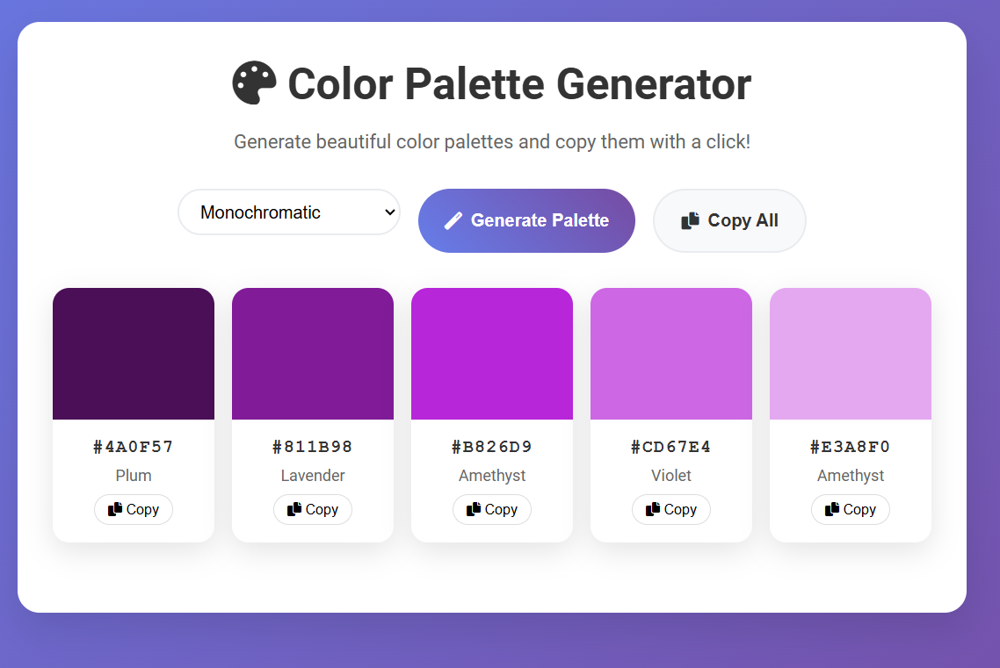

# 🎨 PaletteForge

> Generate beautiful, harmonious color palettes with advanced color theory algorithms


## ✨ Features

- **13 Palette Types** - From complementary to neon, pastel to retro
- **Advanced Color Theory** - Tetradic, split-complementary, compound harmonies
- **One-Click Copy** - Copy individual colors or entire palettes
- **Smart Color Names** - Generates aesthetic names for each color
- **Responsive Design** - Works beautifully on desktop, tablet, and mobile
- **No Dependencies** - Pure HTML, CSS, and JavaScript
- **Fast & Lightweight** - Loads instantly, works offline

## 🚀 Live Demo



## 🎯 Palette Types

| Type                    | Description                             | Best For                   |
| ----------------------- | --------------------------------------- | -------------------------- |
| **Complementary**       | Opposite colors on color wheel          | High contrast designs      |
| **Analogous**           | Adjacent colors on wheel                | Harmonious, natural feel   |
| **Triadic**             | Three evenly spaced colors              | Vibrant, balanced designs  |
| **Tetradic**            | Four evenly spaced colors               | Rich, diverse palettes     |
| **Split Complementary** | Base color + two adjacent to complement | Balanced contrast          |
| **Monochromatic**       | Single hue with varying saturation      | Clean, sophisticated       |
| **Pastel**              | Soft, light colors                      | Gentle, calming designs    |
| **Vibrant**             | High saturation colors                  | Energetic, bold designs    |
| **Earthy**              | Natural, muted tones                    | Organic, grounded feel     |
| **Neon**                | Electric, bright colors                 | Modern, tech aesthetics    |
| **Retro**               | 70s/80s inspired combinations           | Vintage, nostalgic designs |

## 🛠️ Technology Stack

- **Frontend**: Vanilla HTML5, CSS3, JavaScript (ES6+)
- **Styling**: CSS Grid, Flexbox, Custom Properties
- **Icons**: Font Awesome 6
- **Fonts**: Google Fonts (Roboto)
- **No frameworks** - Pure web technologies for maximum performance

## 💻 Local Development

```bash
# Clone the repository
https://github.com/Divya28K/Color-Palette-Generator.git
# Navigate to project directory
cd Color-Palette-Generator

# Open in your browser
open index.html
```

Or use a local server:

```bash
# Python 3
python -m http.server 8000

# Node.js (if you have live-server installed)
npx live-server

# VS Code Live Server extension
# Right-click index.html → "Open with Live Server"
```

## 🎨 Color Theory Implementation

### HSL Color Space

PaletteForge uses HSL (Hue, Saturation, Lightness) for precise color manipulation:

```javascript
// Generate complementary colors
const baseHue = 180; // Cyan
const complement = (baseHue + 180) % 360; // Orange

// Create harmonious variations
const colors = [
  hslToHex(baseHue, 70, 50), // Base color
  hslToHex(complement, 70, 50), // Complement
  hslToHex(baseHue, 50, 70), // Lighter version
  // ... more variations
];
```

### Palette Algorithms

Each palette type uses mathematical relationships:

- **Analogous**: ±30° and ±60° from base hue
- **Triadic**: 120° intervals around color wheel
- **Tetradic**: 90° intervals (square formation)

## 📱 Browser Support

- ✅ Chrome 60+
- ✅ Firefox 55+
- ✅ Safari 12+
- ✅ Edge 79+
- ✅ Mobile browsers (iOS Safari, Chrome Mobile)

## 🤝 Contributing

Contributions are welcome! Please feel free to submit a Pull Request.

### Development Guidelines

1. **Code Style**: Use consistent formatting and meaningful variable names
2. **Performance**: Keep functions pure and avoid unnecessary DOM queries
3. **Accessibility**: Ensure keyboard navigation and screen reader compatibility
4. **Mobile-First**: Test on mobile devices and small screens

### Feature Ideas

- [ ] Export palettes as CSS/SCSS variables
- [ ] Import colors from uploaded images
- [ ] Accessibility contrast checker
- [ ] Save favorite palettes locally
- [ ] Gradient generator between colors
- [ ] Color blindness simulator


## 📊 Project Stats

- **Lines of Code**: ~500
- **Bundle Size**: <50KB total
- **Load Time**: <1 second
- **Lighthouse Score**: 100/100


